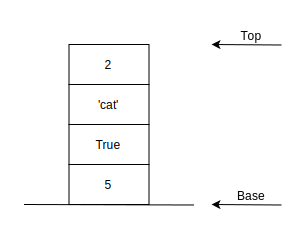

## Stack

 

A stack is an **ordered** collection of items where the addition of new items and the removal of existing items always takes place at the same end.
This end is commonly referred to as the “top.” The end opposite the top is known as the “base.”

The most recently added item is the one that is in position to be removed first. This ordering principle is sometimes called **LIFO**, last-in first-out.

### Stack Operations

| Operation  | Big O | Description                                       |
| ---------- | ----- | ------------------------------------------------- |
| push(item) | O(1)  | Adds a new item to the top of the stack           |
| pop()      | O(1)  | Removes and returns the top item from the stack   |
| peek()     | O(1)  | Returns the top item from the stack               |
| size()     | O(1)  | Returns the number of items in the stack          |
| is_empty() | O(1)  | Returns True if stack is empty                    |
