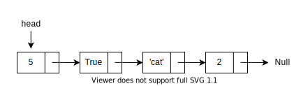

## Linked List

 

A linked list is a linear data structure where each element is a separate object. Each element (node) of a list is comprising of two items - the data and a reference to the next node. The last node has a reference to null. The entry point into a linked list is called the head of the list.

### Linked List Operations

| Operation    | Big O | Description                                           |
| ------------ | ----- | ----------------------------------------------------- |
| add(item)    | O(1)  | Add a new item at the beginning of the list           |
| append(item) | O(n)  | Add a new item at the end the list                    |
| remove(item) | O(n)  | Remove the item from the list                         |
| search(item) | O(n)  | Search for the item in the list                       |
| is_empty()   | O(1)  | Check if the list is empty                            |
| size()       | O(1)  | Return the number of items in the list                |
| index(item)  | O(n)  | Return the position of item in the list               |
| pop()        | O(1)  | Remove and return the last item in the list           |
| pop(position)| O(n)  | Remove and return the item at specified position      |

*Note: Big O depends on the implementation.*

[Back](linear.md)
