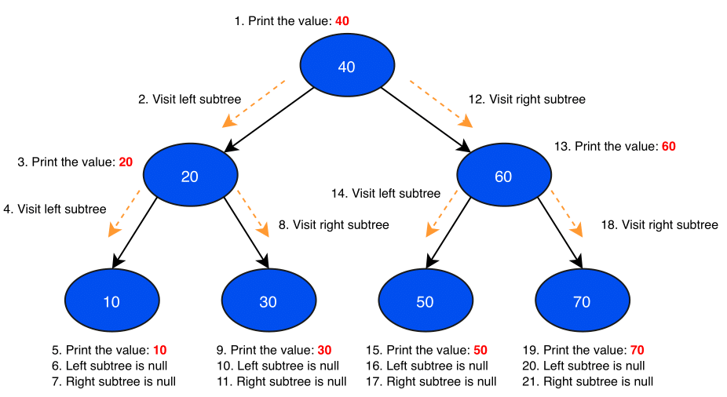
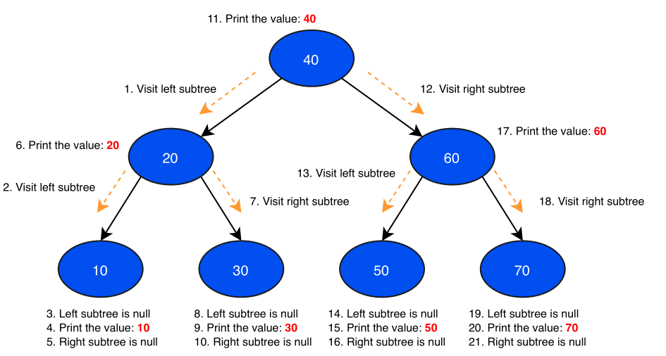
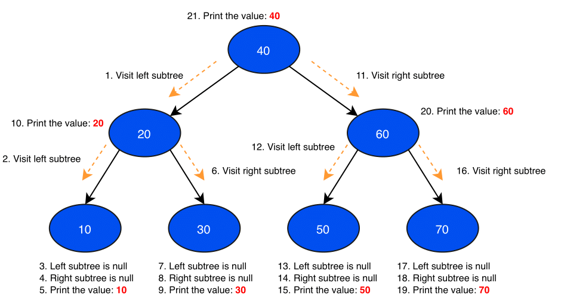
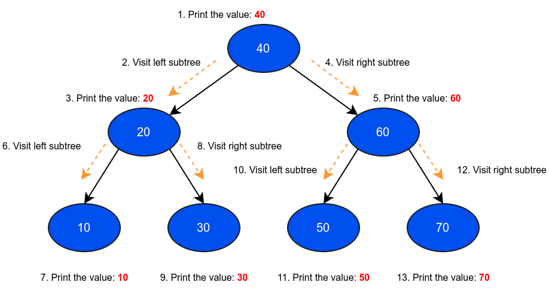

# Tree

## Tree Traversal
“In computer science, tree traversal (also known as tree search) is a form of graph traversal and refers to the process of visiting (checking and/or updating) each node in a tree data structure, exactly once. Such traversals are classified by the order in which the nodes are visited.” — Wikipedia

### DFT (Depth-first traversal)

#### Preorder
In a preorder traversal, we visit the root node first, then recursively do a preorder
traversal of the left subtree, followed by a recursive preorder traversal of the right subtree.

Preorder traversal of above tree is: 40, 20, 10, 30, 60, 50, 70.

#### Inorder
In an inorder traversal, we recursively do an inorder traversal on the left subtree, visit
the root node, and finally do a recursive inorder traversal of the right subtree.

Inorder traversal of above tree is: 10, 20, 30, 40, 50, 60, 70

#### Postorder
In a postorder traversal, we recursively do a postorder traversal of the left subtree
and the right subtree followed by a visit to the root node

Postorder traversal of above tree is: 10, 30, 20, 50, 70, 60, 40.

### BFT (Breadth-first traversal)
In a breadth-first traversal, we traverse through one entire level of children first before moving on to the next level

Breadth-first traversal of above tree is: 40, 20, 60, 10, 30, 50, 70
